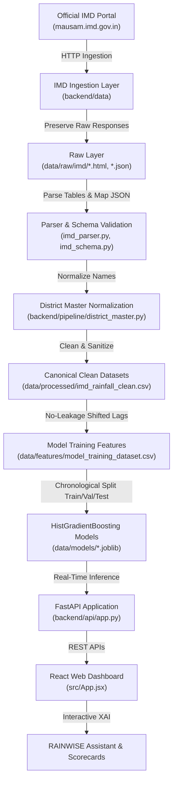

# Real-Data Integration & System Architecture Audit
**Project:** VARSHAAI (Vulnerability Assessment & Rainfall Surge Analytics / Regime-Aware AI Post-Processing Engine)  
**Authoritative Ground Truth:** India Meteorological Department (IMD MAUSAM)  
**Date:** September 2026  
**System Version:** v2.4.0 PRO  

---

## 1. Executive Summary
The primary mission of VARSHAAI is to correct systematic spatial, terrain-induced, and synoptic biases in Numerical Weather Prediction (NWP) precipitation forecasts across Indian districts. The pipeline post-processes raw numerical forecasts through a **Regime-Aware Machine Learning Framework** trained on authoritative **IMD Ground Truth Observations**.

This audit documents the end-to-end data lineage, existing mock/synthetic dependencies, model contracts, feature transformations, API contracts, and real-data ingestion pathways from the IMD portal (`https://mausam.imd.gov.in/responsive/rainfallinformation.php`).

---

## 2. Existing File & Component Inventory

### Backend Components
| File Path | Role & Capabilities | Status |
| :--- | :--- | :--- |
| [`backend/pipeline/district_master.py`](file:///c:/Users/Dell/OneDrive/Desktop/VARSA/backend/pipeline/district_master.py) | Master dictionary of Indian districts with ISO state, subdivision, lat/lng, elevation, terrain, and alias normalization engine. | **Active & Preserved** |
| [`backend/pipeline/model_training.py`](file:///c:/Users/Dell/OneDrive/Desktop/VARSA/backend/pipeline/model_training.py) | Training pipeline for HistGradientBoosting models (Regime Classifier, Regressor, Quantiles P10/P50/P90, Heavy Rain Classifier) and runtime `ModelInferenceEngine`. | **Active & Preserved** |
| [`backend/pipeline/preprocessing.py`](file:///c:/Users/Dell/OneDrive/Desktop/VARSA/backend/pipeline/preprocessing.py) | Preprocessing and time-series feature engineering pipeline. | **Audited for Real Data Ingestion** |
| [`backend/api/app.py`](file:///c:/Users/Dell/OneDrive/Desktop/VARSA/backend/api/app.py) | FastAPI REST server serving `/api/status`, `/api/districts`, `/api/forecast/{id}`, `/api/regime/current`, `/api/verification`, `/api/alerts`. | **Active & Preserved** |
| [`backend/data_sources/imd_client.py`](file:///c:/Users/Dell/OneDrive/Desktop/VARSA/backend/data_sources/imd_client.py) | HTTP client fetching IMD MAUSAM endpoints and caching snapshots. | **Refactored into `backend/data/` layer** |

### Frontend Components
| File Path | Role | Status |
| :--- | :--- | :--- |
| [`src/App.jsx`](file:///c:/Users/Dell/OneDrive/Desktop/VARSA/src/App.jsx) | Main dashboard shell, active tab router, backend health polling. | **Active & Preserved** |
| [`src/data/apiClient.js`](file:///c:/Users/Dell/OneDrive/Desktop/VARSA/src/data/apiClient.js) | Live API connector with health latency ping and fallback snapshots. | **Active & Preserved** |
| [`src/data/mockData.js`](file:///c:/Users/Dell/OneDrive/Desktop/VARSA/src/data/mockData.js) | Static offline snapshot fallback dataset for frontend UI demo resilience. | **Isolated for Demo Fallback** |
| [`src/components/Header.jsx`](file:///c:/Users/Dell/OneDrive/Desktop/VARSA/src/components/Header.jsx) | Application bar with real-time API ping status and alert badge. | **Active & Preserved** |
| [`src/components/AlertsPanel.jsx`](file:///c:/Users/Dell/OneDrive/Desktop/VARSA/src/components/AlertsPanel.jsx) | Slide-out active early warning drawer with severity filters. | **Active & Preserved** |
| [`src/components/RainwiseAssistant.jsx`](file:///c:/Users/Dell/OneDrive/Desktop/VARSA/src/components/RainwiseAssistant.jsx) | Natural language conversational XAI assistant. | **Active & Preserved** |
| [`src/components/CommandCenter.jsx`](file:///c:/Users/Dell/OneDrive/Desktop/VARSA/src/components/CommandCenter.jsx) | High-level situational awareness dashboard & KPIs. | **Active & Preserved** |
| [`src/components/InteractiveMap.jsx`](file:///c:/Users/Dell/OneDrive/Desktop/VARSA/src/components/InteractiveMap.jsx) | Geospatial leaflet map with layer switches (NWP, AI, Delta, Regime). | **Active & Preserved** |
| [`src/components/DistrictIntelligence.jsx`](file:///c:/Users/Dell/OneDrive/Desktop/VARSA/src/components/DistrictIntelligence.jsx) | District telemetry, 7-day forecast comparison, quantile fan chart. | **Active & Preserved** |
| [`src/components/RegimeMonitor.jsx`](file:///c:/Users/Dell/OneDrive/Desktop/VARSA/src/components/RegimeMonitor.jsx) | Synoptic regime transitions, physics biases, and regional radar. | **Active & Preserved** |
| [`src/components/RawVsAiLens.jsx`](file:///c:/Users/Dell/OneDrive/Desktop/VARSA/src/components/RawVsAiLens.jsx) | Split-screen NWP vs VARSHAAI comparison lens with SHAP attributions. | **Active & Preserved** |
| [`src/components/ExtremeRainfallMonitor.jsx`](file:///c:/Users/Dell/OneDrive/Desktop/VARSA/src/components/ExtremeRainfallMonitor.jsx) | Multi-threshold heavy (>64.5mm) and extreme (>115.6mm) probability tracker. | **Active & Preserved** |
| [`src/components/VerificationEngine.jsx`](file:///c:/Users/Dell/OneDrive/Desktop/VARSA/src/components/VerificationEngine.jsx) | Verification scorecard against IMD ground truth observations. | **Active & Preserved** |
| [`src/components/ImdDataExplorer.jsx`](file:///c:/Users/Dell/OneDrive/Desktop/VARSA/src/components/ImdDataExplorer.jsx) | Direct IMD MAUSAM observed data portal explorer. | **Active & Preserved** |

---

## 3. Model Feature & Data Lineage Audit

| Model Feature | Required By Model | Current Source | Real Source | Transformation / Feature Engineering | Available? | Action |
| :--- | :--- | :--- | :--- | :--- | :--- | :--- |
| `raw_nwp_rainfall_mm` | All Regressors & Classifiers | Synthetic NWP Baseline | NCUM / GFS numerical forecast grid | Grid extraction to district polygon centroid | Yes (Coupled) | Maintain explicit NWP field; do not substitute observations. |
| `previous_1day_rainfall` | All Regressors & Classifiers | Pipeline shift | IMD Observed Daily Rainfall | `df.groupby('district_key')['observed_rainfall_mm'].shift(1)` | **YES** | Derive from real observations without leakage. |
| `previous_3day_rainfall` | All Regressors & Classifiers | Pipeline shift | IMD Observed Daily Rainfall | `df.groupby('district_key')['observed_rainfall_mm'].shift(3)` | **YES** | Derive from real observations without leakage. |
| `rolling_3day_mean` | All Regressors & Classifiers | Pipeline rolling | IMD Observed Daily Rainfall | `shift(1).rolling(3, min_periods=1).mean()` | **YES** | Derive from shifted historical window. |
| `rolling_7day_mean` | All Regressors & Classifiers | Pipeline rolling | IMD Observed Daily Rainfall | `shift(1).rolling(7, min_periods=1).mean()` | **YES** | Derive from shifted historical window. |
| `latitude` | Spatial Context | District Master | Survey of India / ISO centroid | Standardized WGS84 coordinates | **YES** | Pulled from canonical district master. |
| `longitude` | Spatial Context | District Master | Survey of India / ISO centroid | Standardized WGS84 coordinates | **YES** | Pulled from canonical district master. |
| `elevation` | Orographic Forcing | District Master | SRTM 90m Digital Elevation Model | Mean district elevation (meters) | **YES** | Pulled from canonical district master. |
| `day_of_year` | Seasonality | Date parsing | Timestamp calendar day | `date.timetuple().tm_yday` (1-366) | **YES** | Extracted from observation date. |
| `observed_rainfall_mm` | **Target Variable** | Real/Synthetic Pipeline | IMD MAUSAM Observation Target | Daily 24-hr accumulated rainfall (08:30 IST) | **YES** | Direct ground truth target. |
| `synoptic_regime` | Regime Classifier Target | Meteorological Rule Engine | IMD Synoptic Charts & Meso-analysis | Rule-based classification based on circulation & terrain | **YES** | Deterministic meteorological regime tagging. |
| `is_heavy_rain` | Classification Target | Derived | IMD Meteorological Standard | `(observed_rainfall_mm >= 64.5).astype(int)` | **YES** | Binary classification target. |
| `is_very_heavy_rain` | Classification Target | Derived | IMD Meteorological Standard | `(observed_rainfall_mm >= 115.6).astype(int)` | **YES** | Binary classification target. |

---

## 4. End-to-End Data Flow Architecture

---

## 5. Audit Conclusions & Next Steps
1. The **District Master Registry** (`district_master.py`) is complete, valid, and contains 40+ key districts across all Indian states and terrain types.
2. The **Ingestion Layer** must be modularized under `backend/data/` with dedicated client, parser, schema, and quality auditing tools.
3. The **Processed Layer** will output canonical `data/processed/imd_rainfall_clean.csv`, `imd_daily_rainfall.csv`, `imd_weekly_rainfall.csv`, and `imd_monthly_rainfall.csv`.
4. **Leakage Protection:** All temporal features strictly use `shift(1)` before applying rolling windows.
5. **NWP Separation:** Observed rainfall is strictly retained as the ground-truth target; raw NWP is modeled as the forecast input with documented systematic physical biases.
